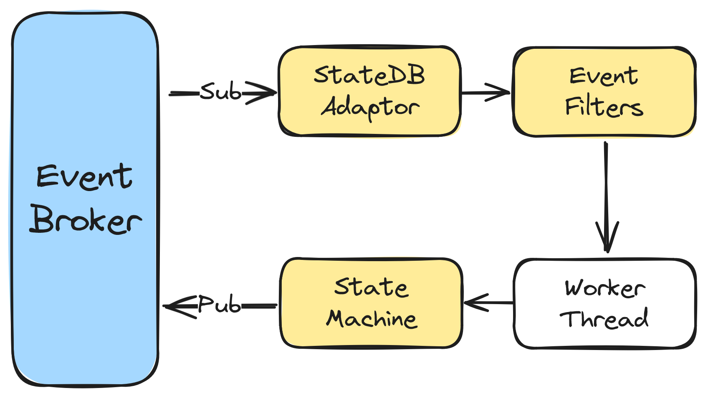

# streamer

Streamer is an internally developed Event-Driven Architecture (EDA) framework by Arcology. It offers a unified solution for seamless inter-thread and inter-process communication regardless of deployment method or location. 

## How It Work ⚙️

In Streamer, an Event Broker serves as the central hub for managing and distributing events flow to and from actors. Each actor comprises a State Machine that controls overall actor state transitions, an Event Filter governing event relationships and triggering the associated Worker Thread. Developers embed custom logic in the Worker Thread for event and data processing. 

- **Actors:** Entities reacting to broker events, comprising a State Machine, Event Filter, and Worker Thread.

- **Event Broker:** Manages event flow to and from actors.

## Key Features 

- Unified Framework: Abstracts event broker logic into a unified framework, eliminating the need for multiple brokers.

- Built-in Filters: Manages complex event flows efficiently with built-in event filters.

- 3rd-party Integration: Seamlessly integrates with Apache Kafka for high-throughput inter-process communication.

- Deployment Flexibility: Separates implementation from deployment, emphasizing flexibility.

<h2> Kafak Integration    </h3>

Streamer's event broker is designed to work inter-thread communication only. If one event broker in Streamer needs to communicate with others residing in different processes, it requires assistance from inter-process communication modules. Streamer seamlessly integrates with 3rd-party systems like Apache Kafka for high-throughput inter-process communication.

## Use Cases

- Scalable EDA: Suited for high-scalability event-driven architecture.

- Distributed Streaming: Ideal for distributed streaming with scalability, durability, and fault tolerance.

Explore the technical power of Streamer for efficient event-driven architecture with scalability and flexibility. Happy coding!
<!--  -->

