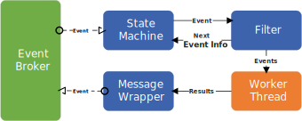
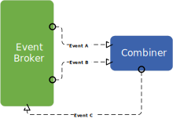
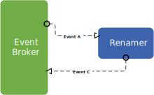

## 2. Actor

An actor in Streamer refers to a component or entity within a system that generates, processes, and responds to events. The actors have internal states that are invisible and inaccessible to external modules. The actors communicate by relying on events to interact with each other. In Streamers, the inter-actor communication is generally asynchronous, although synchronous communication is also allowed in some cases for convenience. An actor generally communicates only with the event broker it is connected to.

### 2.2. Event Filter
The filter(conjunction/disjunction) defines the relationship of the subscribed events. When a thread register with the broker it need to tell if it is conjunction or disjunction filter. 

- **Conjunction Filter:**
Based on the filter type. The Events received can be relayed to the working thread right away and it will be buffered first. for example if a worker thread says it need the event e0 and e1, and the relationship between worker thread is in a conjunction filter, it means only when the filter have both of them, it will feed the messages to the worker thread. Otherwise, the filter will buffer it and wait for another one to arrive.

- **Disjunction Filter:**
 A disjunction filter allow any of the subscribed events to pass as soon as they are received freely. 

### 2.3.  Worker Thread
A Worker Thread is the unit of code doing real data processing on the event data received. It receives the events from the filter and may generate some output events afterward. A work thread may or may not emit output messages depending on its internal logic.

### Message Wrapper 
The wrapper packs up the output from the worker thread and convert it into a format ready for the event broker to publish under the corresponding topic. 

## Interaction 
 

  

## Builtin Actors
The package comes with some builtin actors. 

### 1. Combiner

The Combiner is a special actor designed to merge multiple events into a single event. The Combiner has an internal buffer to store out-of-sequence messages until a complete sequence of events is received. This actor can handle a stream of messages that may arrive out of order. Finally, the messages are grouped together and published back to the event broker. Similar to other built-in actors, a Combiner does not alter the contents of the messages.

  

### Renamer
The renamer actor is tasked with giving an event a new name. The old event may still exist in the system.

  

