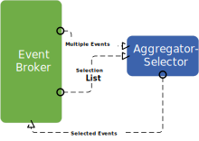

## Aggregator-Selector

The Resequencer can receive a stream of messages that may not arrive in order. The Resequencer contains in internal buffer to store out-of-sequence messages until a complete sequence is obtained. The in-sequence messages are then published to the output channel. It is important that the output channel is order-preserving so messages are guaranteed to arrive in order at the next component. Like most other routers, a sequencer doesn't modify the message contents.***

  

 