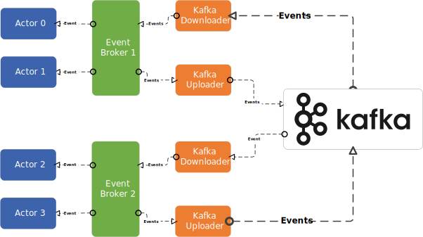

 ## Inter-process Communication

Streamer's event broker is designed to work inter-thread communicaiton only. If one event broker in Streamer needs to communicate with others residing in different processes, it requires assistance from inter-process communication modules. Streamer integrats 3rd-party solutions to facility high-throughput inter-process communication. 

This design ensures that the rest of Streamer remains agnostic to the inter-process communication details, allowing for easier updates or modifications to the integration of a inter-process layer without affecting the core functionalities of the Streamer framework.

### Kafka Integration

Currently, Streamer comes with two specific types of built-in actors known as Kafka Uploader and Downloader. These actors are the bridges connecting different Streamer instances. The Downloader subscribes to events from the event broker and then relays them to the connected Kafka instance. Conversely, the Uploader performs the opposite function. Streamer integrates with Apache Kafka through these special actors.

  

 
####  Uploader 

The Kafka Uploader exclusively receives events from the event broker, encodes them, and subsequently relays these events to specific Kafka topics. Its role is isolating the communication details of Kafka from other modules of the Streamer framework. 

####  Downloader

The Kafka Downloader is designed to retrieve events from Kafka topics, and decode them before relaying them to the event broker within the Streamer framework.
Similar to the Uploader, the Downloader ensures that the rest of the Streamer system remains agnostic to the intricacies of communicaiton wit external event sources. 
