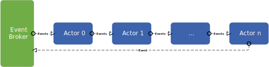

## Sequencer

The sequencer is a specialized actor responsible for serializing a sequence of individual actors. This scenario commonly occurs when multiple actors collaborate in a sequential manner to process events. In this process, each actor generates some output events, which are then processed by the subsequent actor, creating a chain-like flow. The sequencer serves as a mechanism to bind these actions together, ensuring that the processing occurs in a specific serial order. 

The decision to use multiple actors with a sequencer is often driven by the requirements of the system.

<p align="center">
  
</p>

## Single Actor vs sequencer

There are a few advantages why connecting multiple actors together with a sequencer instead of combining them into a single actor. 

- **Modularity：**
It's often easier to modify or extend a specific actor rather than modifying a monolithic actor that does everything. If a specific processing step needs to be replaced or modified, it can be done without affecting others.
- **Deployment：**
In a distributed deployment setup, the different actors may be deployed to different machines. Combining multiple actors into one isn't always possible.

``` go


```


